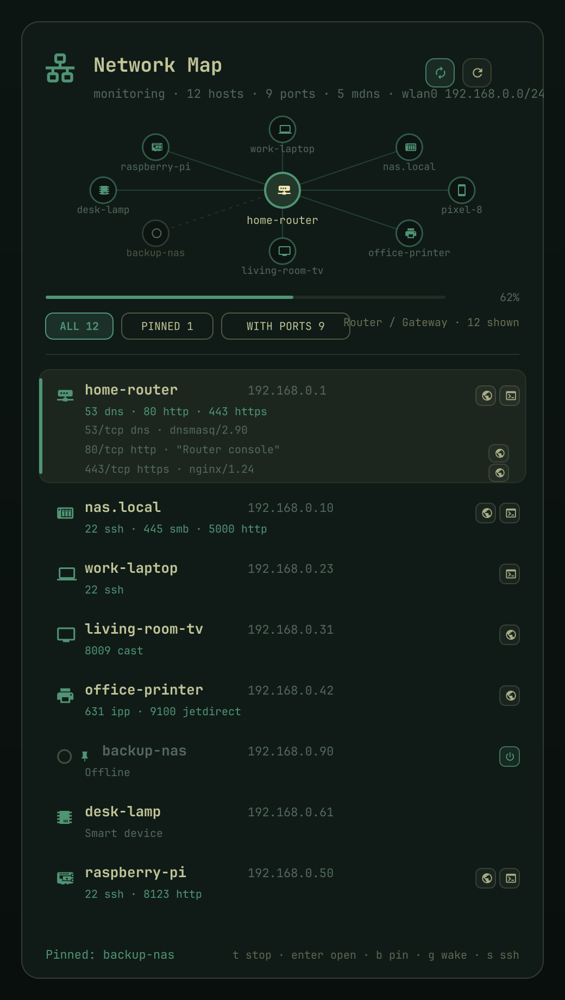
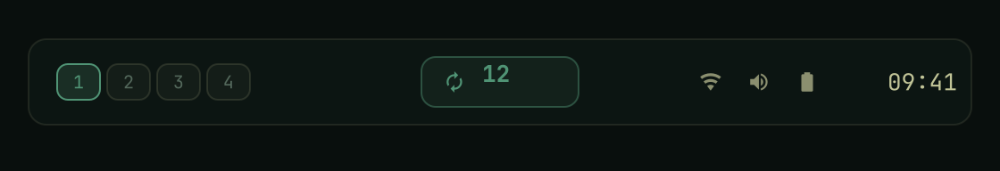

# netmap - a live map of your LAN, in the omarchy bar

Two parts that fit together:

| part | what it is | where |
|---|---|---|
| **netmap** (backend) | a Rust scanner: mDNS/DNS-SD discovery, ARP, a mass-parallel TCP port scan, protocol identification, device classification. Streams newline-delimited JSON. | backend/ |
| **Network Map** (frontend) | an omarchy shell plugin: a bar widget that opens a panel with a topology map, a keyboard-driven host list, and one-keystroke ssh / browser / copy actions. | manifest.json, Panel.qml |

Everything runs locally and unprivileged: a TCP connect scan needs no root, and
nothing is sent off the machine. By default only your own interface subnets are
scanned.

## What it looks like

*The panel: the LAN as a map, a keyboard-driven host list, and one-keystroke
open / ssh / wake chips. (Mocked with example data - not a real network.)*

*The bar widget: the host count, with a loop glyph while continuous monitoring
is on.*

## Install

    git clone <this repo> ~/Work/omarchy-netmap
    cd ~/Work/omarchy-netmap
    ./install.sh

That builds the backend, installs '~/.local/bin/netmap', copies the plugin into
'~/.config/omarchy/plugins/omarchy-netmap/', validates the manifest, reloads the
shell and adds the widget to the bar. While you are editing the QML,
'./install.sh --sync-only' re-copies it and the shell hot-reloads it.

To install the plugin the omarchy way instead:

    omarchy plugin add <git-url> --enable --yes

then run the repo's './install.sh' once so 'netmap' lands on your PATH.

## Use

The bar icon shows the host count; click it to open the panel, 'r' to rescan.

| key | action |
|---|---|
| 'j' / 'k' or arrows | move the cursor through the host list (the map follows) |
| 'h' / 'l' | step into the action chips of the selected host |
| 'enter' | the primary action: open the web UI, else ssh, else copy the address |
| 's' | ssh into the selected host, on its ssh port, in a terminal |
| 'o' | open the host's web UI in the browser (only ever an http/https URL) |
| 'w' | open the host's web UI as a web app |
| 'p' | play the host's stream (rtsp) in vlc / mpv / ffplay |
| 'b' | pin the selected machine (it then stays on screen even when it is off) |
| 'g' | wake the selected machine with a Wake-on-LAN magic packet |
| 't' | start or stop continuous monitoring |
| 'c' | copy the address |
| 'f' | cycle the filter: all / with ports / named |
| 'd' | show or hide the identified services |
| 'i' | show everything known about the selected host |
| 'r' | one-shot rescan (monitoring is stopped first, so the two never overlap) |
| 'esc' | close |

Mouse: click a map node to select it, click it again to run its primary action;
click a row to run its primary action; right-click a row to copy the address;
the small chips at the right edge of a row are ssh and open.

Bind a key to it (omarchy reads '~/.config/hypr/bindings.conf'):

    bindd = SUPER, N, Network map, exec, omarchy-shell shell toggle omarchy-netmap '{}'

## Continuous monitoring

The service watches the network the way a monitor should: one long-lived scanner
process that runs a round every 'intervalSec' (3600s - hourly - by default) and
asks the backend what changed since the previous round. Nothing pops in and out of the
map between rounds: nodes stay where they are and only leave when a diff says
they are gone.

* it starts by itself at shell startup ('autoScan: On'), and it keeps running
  when you close the panel, because that is the point of monitoring;
* the bar icon shows a small loop glyph while it is on, and the panel's loop
  button (next to the refresh button) turns it on and off;
* changes are recorded as diffs and shown as a toast in the panel. Desktop
  alerts ("Network change") are **off by default** ('notify: Off'); turn them on
  with 'omarchy bar set omarchy-netmap notify On' if you want them. When they are
  on they are rate limited to one per 15 seconds.

Turn it off with 't' in the panel, or for good:

    omarchy bar set omarchy-netmap autoScan Off
    omarchy bar set omarchy-netmap intervalSec 3600     # how often a round runs

A one-shot scan is always available: 'r' in the panel, or 'netmap scan' in a
shell.

## Pin a machine and wake it (Wake-on-LAN)

Press 'b' on a host to pin it. A pin is stored as '{"mac": ..., "ip": ..., "name": ...}' in
the widget's entry in '~/.config/omarchy/shell.json': the MAC is what
wake-on-LAN needs and what survives a DHCP change, and the address and name let
the panel keep drawing the machine while it is switched off. A pinned machine

* sorts to the top of the list (after the gateway),
* shows a pin glyph next to its name and a power chip on its row,
* is still listed when the scan cannot see it, greyed out and labelled
  "Offline", so pressing 'enter' on it sends the magic packet,
* is filtered by the 'PINNED' filter ('f' cycles all / pinned / with ports).

Waking sends the classic magic packet from the backend, which knows the local
interface broadcasts:

    netmap wol de:ad:be:ef:00:01              # by MAC
    netmap wol --ip 192.168.1.42              # MAC read from the ARP cache
    netmap wol aa:bb:cc:dd:ee:ff --repeat 5 --json

The packet goes to every local broadcast address, to 255.255.255.255, and to the
address the machine last held (plenty of switches do not forward a broadcast to
a sleeping port). 25 seconds after a wake the panel runs one extra round, so the
machine appears as soon as it is up instead of at the next hourly scan.

This only works if the machine is configured for it: wake-on-LAN enabled in the
BIOS/UEFI and on the network card ('ethtool -s <iface> wol g'), and the card
keeps power while the machine is off. Waking needs a MAC, so pin a machine that
has been seen at least once - a pin made from an address alone can be copied but
not woken.

## Media and ssh actions

A host with a stream gets a play chip, not a browser chip: rtsp URLs go to
'vlc', else 'mpv', else 'ffplay', else whatever handles 'rtsp://' on your
system. A browser is only ever handed an http or https URL - a launcher that is
given anything else turns it into a file:// URL, which is exactly how a camera
or an adb endpoint used to end up in a browser window.

IPC, for scripts and keybinds:

    omarchy-shell shell toggle omarchy-netmap '{}'
    omarchy-shell omarchy-netmap rescan
    omarchy-shell omarchy-netmap filter open
    omarchy-shell omarchy-netmap state       # what the panel is showing, as JSON

## Settings

Settings live inline on the widget's entry in '~/.config/omarchy/shell.json',
like every other omarchy widget:

    omarchy bar set omarchy-netmap ports 22,80,443,3389
    omarchy bar set omarchy-netmap timeoutMs 250
    omarchy bar set omarchy-netmap sshUser pi

| key | default | meaning |
|---|---|---|
| 'ports' | top | 'top', 'all', 'web', or a list: 22,80,443 / 1-1024 |
| 'concurrency' | 1024 | parallel connects in flight |
| 'timeoutMs' | 400 | connect timeout; drops automatically to ~6x the fastest RTT |
| 'mdns' | auto | auto / native / avahi / off |
| 'mdnsMs' | 2500 | how long to listen for mDNS answers |
| 'deepProbe' | On | speak to open ports to identify the protocol |
| 'netbios' | On | NetBIOS name queries for otherwise anonymous hosts |
| 'autoScan' | On | start monitoring shortly after the shell starts |
| 'intervalSec' | 60 | monitoring interval, and the panel refresh interval |
| 'notify' | Off | desktop alerts when monitoring notices a change |
| 'pinned' | [] | pinned machines, managed from the panel with 'b' |
| 'subnets' | empty | override the subnet list, e.g. "192.168.1.0/24 10.0.0.0/24" |
| 'sshUser' | empty | user for the ssh action (pi@192.168.1.5) |
| 'showCount' | On | show the host count next to the bar icon |
| 'listHeight' | 260 | height of the host list, in pixels |

## CLI

    netmap                                   scan, human readable report
    netmap scan --jsonl                      one JSON event per line, streamed
    netmap scan --ports all --timeout 800    the full 1-65535 sweep
    netmap scan --watch 60                   rescan every 60 seconds
    netmap scan --subnet 10.0.0.0/24         somewhere other than the default route
    netmap scan --mdns avahi --no-probe      discovery only, no port probing
    netmap ifaces                            interfaces, gateway and ARP cache
    netmap ports web                         the curated port table
    netmap wol <mac> | --ip <ip>             wake a machine (magic packet)

Human mode prints discoveries on stdout as they happen and progress on stderr,
so 'netmap scan > hosts.txt' still shows a live progress line.

## How it works

    backend/src/
      main.rs, cli.rs      command line
      interfaces.rs        getifaddrs, /proc/net/route, /proc/net/arp
      mdns.rs              native mdns-sd browser + avahi-browse, deduplicated
      ports.rs             158 curated ports, and how to probe each one
      probe.rs             banner / HTTP / TLS / Redis / memcached / RTSP probes
      netbios.rs           NetBIOS NBSTAT name queries
      oui.rs               MAC prefix to vendor hints
      classify.rs          evidence to a device class and an icon
      scan.rs              the parallel driver and the shared map
      emit.rs              JSON Lines, JSON and table rendering

Three things keep a scan fast without losing hosts:

* a **sliding window** over host/port pairs, so memory stays flat even for a
  full 65535 sweep and the in-flight count is exactly 'concurrency';
* an **adaptive timeout**: after three hosts have answered, the connect timeout
  drops to about six times the fastest observed round trip, with a 120ms floor;
* a **bail-out** on silent hosts: after eight consecutive timeouts a host is
  dropped for the rest of the run instead of costing one timeout per port. A
  connection *refused* proves the host is alive, so it never counts as a
  timeout - which is why quiet hosts still show up.

Open ports are then identified by a second, bounded pass: banner read, HTTP GET
(over TLS as well, with the other transport tried as a fallback), Redis PING,
memcached version, RTSP OPTIONS. mDNS-advertised TCP ports are verified with a
real connect, because an advertisement is a claim and a connect is evidence.

### The event stream

'netmap scan --jsonl' emits one JSON object per line, and every host event is a
complete snapshot, so a consumer can just replace its record for that address:

| type | payload |
|---|---|
| meta | version, interfaces, gateway, target and port counts - starts a round |
| host | the whole record: names, mac, vendor, rtt, ports, mDNS services, class |
| mdns | one resolved service: instance, type, host, address, port, TXT |
| progress | phase, done, total, alive, open_ports |
| status | a human line ("open 192.168.1.5:80 http") |
| diff | what changed since the previous round: added/removed hosts and ports (watch mode only, only when something changed) |
| done | summary: elapsed, hosts, alive, open ports, services, class histogram |

Host records carry 'web_url' and 'ssh_port', which is how the panel decides what
"enter" means.

## Tests

    cd backend && cargo test        # 50 Rust tests
    node tests/model.test.js        # the panel's pure logic

The node tests cover the event folding, host ordering, the action preference
(browser before ssh), the map layout, and the glyph codepoints - including that
every glyph is a valid surrogate pair the Nerd Font actually contains.

## Notes and limits

* IPv4 only. mDNS-discovered IPv6-only devices are listed as services but have
  no node on the map.
* No UDP scanning: mDNS, NetBIOS and the ARP cache aside, this is a TCP connect
  scanner.
* '--ports all' is 65535 probes per host: pair it with '--hosts' or a /32 unless
  you are patient.
* Hostnames come from mDNS and NetBIOS only; there is no reverse DNS, which is
  slow and usually wrong on a home LAN.
* The TLS probe deliberately accepts any certificate. Nothing is trusted or
  exchanged: it only answers "does this port speak TLS".
* The vendor column is an OUI hint from a curated table of ~200 prefixes, shown
  next to - never instead of - the port and mDNS evidence.
* The panel talks to the backend through one child process per scan, or a
  single long-lived one in watch mode. Monitoring started at startup keeps
  running after the panel closes; 't' or 'autoScan: Off' stops it.
* Wake-on-LAN is a broadcast: it cannot tell whether anyone listened. The panel
  reports how many packets went out, and the follow-up round reports whether the
  machine actually came up. No notification is raised for changes unless
  'notify' is On; a failure you triggered yourself (a stream, a wake) always
  reports itself, because otherwise it would look like nothing happened.
* Actions are built from scalars and validated before launch: a browser only
  gets http(s), a media player only gets a stream URL, and copy only accepts an
  address. An unrecognised action shows a toast instead of launching something
  random.
* Icon codepoints are pinned by a test in both the Rust backend and the node
  suite. Nerd Font codepoints are easy to get wrong by one row, and a wrong one
  renders a completely different icon (a hard disk where "open in browser" was
  meant to be).

## Troubleshooting

| symptom | fix |
|---|---|
| The panel says "netmap backend not found" | run './install.sh' in the repo, or point 'NETMAP_BIN' at the binary |
| No mDNS services at all | try 'omarchy bar set omarchy-netmap mdns avahi' - that asks the system avahi daemon instead of binding a second 5353 socket |
| A scan feels slow | lower 'timeoutMs' (250 is plenty on wifi) or narrow 'ports' |
| A device shows as "Host" with no ports | it answers ARP but has no open port from the curated list; try 'omarchy bar set omarchy-netmap ports all' |
| An IPC method stopped answering after editing the QML | the panel hot-reloads, but the first instance keeps the IPC target: 'omarchy restart shell' |
| Play does nothing, or opens a browser | no player was found: install 'vlc' or 'mpv', or check 'omarchy-shell shell call omarchy-netmap state' for the detected 'player' |
| The panel overflows its card on a small screen | lower 'listHeight', or collapse the details with 'd' |
| Waking a machine does nothing | the panel and 'netmap wol' only send the magic packet; if the machine stays off it is not listening. Enable wake-on-LAN in its BIOS/UEFI *and* on its network card ('ethtool -s <iface> wol g'), and keep the card powered while the machine is off. A packet broadcast from a wifi client may also not reach a sleeping wired port. To see exactly what the plugin sent (MAC, address, packet count): 'journalctl --user -g netmap' |
